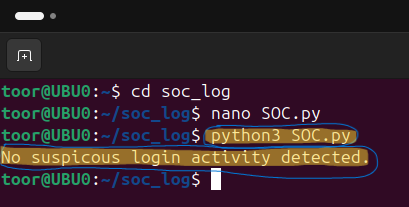

it# Detection-Lab-

## Python SOC Authentication Log Analyzer 

## Overview
This lab simulates a SOC Tier-1 authentication log analysis tool. The script evaluates system authentication logs and flags suspicous activity based on predefined authentication thresholds. This Authentication will quickly distinguish authetnication patterns of brute-force or credintal abuse attacks. 

## How It Works 
1. Parse an uploaded authentication log file
2. Counts failed login attempts
3. Notifies when it reaches threshold login attempts
4. Outputs a clear security status message

## Clean Log Analysis OUTPUT
The following output is my own auth.log from /var. It shows normal authentication traffic. No anomalies in this log file. 

## Suspicous Log Analysis OUTPUT 
This examples shows how the analyzer responded to data logs that fit the login pattern thresholds. This log is a practice set of susioupous auth.log. 

